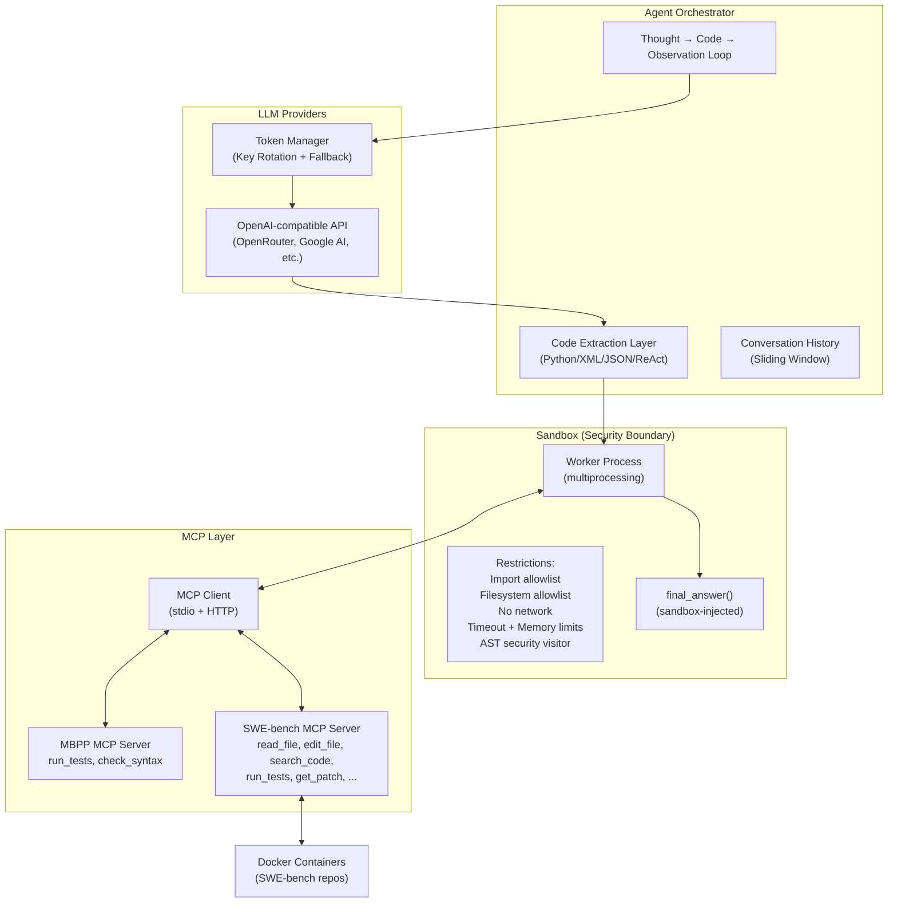

*This project has been created as part of the 42 curriculum by anrogard.*

# Agent Smith

> Autonomous reasoning, code generation, and execution

## Description

Agent Smith is an agentic framework capable of autonomously solving coding challenges. It implements a **Code Agent** that reasons about programming tasks, generates executable Python code, executes it in a controlled sandbox environment, uses tools via **MCP (Model Context Protocol)** to interact with files, tests, and repositories, observes results, and refines its approach.

The system operates through a structured **Thought → Code → Observation** loop and is evaluated against two benchmarks:

- **MBPP** (Mostly Basic Python Problems): algorithmic Python challenges
- **SWE-bench**: real-world bug fixing in production repositories inside Docker containers

The core challenge is not only to make the agent intelligent, but also to make it **safe**, **controlled**, **reproducible**, and **measurable**.

## System Architecture



## Agent Loop Explanation

The agent operates using a **Thought → Code → Observation** loop:

1. **System prompt construction**: Tool documentation is dynamically generated from the connected MCP server's tool schemas. The prompt includes available tools, response format requirements, and methodology guidelines.

2. **LLM call**: The agent sends the full conversation history (with sliding window truncation) to the LLM API. Token rotation handles rate limits; `stop_sequences` (`Observation:`, `<end_code>`) prevent the model from hallucinating tool output.

3. **Code extraction**: The LLM response is parsed for executable code. Supported formats:
   - Python markdown blocks (primary): `` ```python ... ``` ``
   - Unclosed markdown blocks (LLM hit stop token)
   - XML tool calls (Anthropic-style): `<invoke name="...">...</invoke>`
   - JSON/Hermes tool calls: `<tool_call>{"name": "...", "arguments": {...}}</tool_call>`
   - ReAct format: `Action: ... / Action Input: {...}`

4. **Sandbox execution**: Extracted code runs in a separate process with full security restrictions. MCP tool wrappers are available as callable Python functions.

5. **Observation feedback**: The sandbox result (stdout, error, or final_answer) is fed back to the LLM as the next observation. Explicit feedback is given for:
   - No valid code block found
   - Execution timeout (partial output)
   - Tool output truncation
   - Syntax errors from edits

6. **Termination**: The loop ends when `final_answer()` is called, or when iteration/token/time limits are reached.

### Limits

| Metric | MBPP | SWE-bench |
|--------|------|-----------|
| Max iterations | 10 | 30 |
| Max input tokens | 6,000 | 300,000 |
| Max output tokens | 1,500 | 10,000 |
| Timeout | 120s | 900s |

## Sandbox Design

The sandbox is the **central execution layer** and the **safety boundary** between the autonomous agent and the real world.

### Isolation Architecture
- **Process isolation**: Code runs in a `multiprocessing.Process` — a completely separate process with its own memory space
- **Resource limits**: `RLIMIT_AS` (memory) and `RLIMIT_CPU` (timeout) enforced via `resource.setrlimit`
- **Main process supervision**: The parent process monitors the worker and kills it if the timeout is exceeded

### Security Restrictions
- **Import allowlist**: Only modules from `SandboxConfig.authorized_imports` may be imported. An entry ending in `.*` also allows submodules (e.g., `collections.*` permits `collections.abc`)
- **Filesystem allowlist**: File access is restricted to directories in `SandboxConfig.allowed_directories` via an overridden `open()` builtin
- **No network**: All `socket` operations are monkey-patched to raise `PermissionError`
- **Dangerous builtins removed**: `eval`, `exec`, `compile`, `globals`, `locals`, `vars`, `input`, `breakpoint`
- **AST security visitor**: Before execution, the code's AST is scanned and access to dangerous dunder attributes (`__class__`, `__subclasses__`, `__bases__`, `__mro__`, `__globals__`, `__builtins__`, `__code__`, `__func__`, `__dict__`) is blocked

### Configuration
Sandbox behavior is fully configurable via Pydantic models and JSON configuration files:

```json
{
  "authorized_imports": ["math", "math.*", "collections", "collections.*", "..."],
  "allowed_directories": ["/testbed", "/tmp/agent"],
  "max_execution_time_seconds": 30,
  "max_memory_mb": 512
}
```

### Interactive REPL
The sandbox provides an interactive REPL mode (`uv run sandbox`) that follows the same restrictions and supports MCP tool connections.

## Tool Implementation Details

Tools are implemented as **MCP servers** using the FastMCP library and exposed as **callable Python functions** in the sandbox namespace.

### MBPP Tools (`mcp_tools_mbpp.py`)
| Tool | Description |
|------|-------------|
| `run_tests(code, test_list)` | Execute a candidate solution against test assertions. Returns JSON with `success` boolean and `output` field |
| `check_syntax(code)` | Check Python code for syntax errors without executing it |

### SWE-bench Tools (`mcp_tools_swebench.py`)
| Tool | Description |
|------|-------------|
| `read_file(filepath, start_line, end_line)` | Read file content with line numbers (`N: content`) |
| `edit_file(filepath, old_str, new_str)` | Replace exact string in file; reports syntax errors |
| `list_files(directory, pattern)` | List files matching a glob pattern |
| `search_code(pattern, file_pattern)` | Grep-like search across the codebase |
| `search_function_or_class_definition_in_code(name)` | Find function/class definitions |
| `find_references(name, filepath, line)` | Find all usages of a symbol |
| `run_tests()` | Execute the evaluation script |
| `get_patch()` | Get unified git diff of all changes |
| `run_command(command, workdir)` | Execute a shell command |

### Dynamic Tool Discovery
The **sandbox manual** (tool documentation for the LLM) is dynamically generated from the connected MCP server's tool schemas — tool names, descriptions, parameter types and descriptions. When a different MCP server is connected, the manual automatically reflects that server's tools.

### Transport Support
Both **stdio** and **streamable HTTP** transports are supported for MCP server connections.

## Instructions

### Installation
```bash
uv sync
```

### Interactive Sandbox
```bash
# Launch interactive REPL
uv run sandbox

# With custom configuration
uv run sandbox sandbox_config.json

# With MBPP tools (stdio)
uv run sandbox --mcp-stdio "python mcp_tools_mbpp.py" sandbox_config.json

# With SWE-bench tools
uv run sandbox --mcp-stdio "python mcp_tools_swebench.py" sandbox_config.json

# With MCP tools (HTTP)
uv run sandbox --mcp-server http://localhost:8000
```

### MBPP Agent
```bash
uv run python -m agent_mbpp \
  --task-file task.json \
  --output solution.json \
  --model-name "qwen/qwen3-235b-a22b:free" \
  --provider-url "https://openrouter.ai/api/v1"
```

### SWE-bench Agent
```bash
uv run python -m agent_swebench \
  --task-file task.json \
  --output solution.json \
  --model-name "qwen/qwen3-235b-a22b:free" \
  --provider-url "https://openrouter.ai/api/v1"
```

### Environment Variables
API keys are loaded from environment variables. Set them in a `.env` file:
```bash
OPENROUTER_API_KEY=your-key-here
OPENROUTER_API_KEY_1=your-second-key
OPENROUTER_API_KEY_2=your-third-key
```

## Benchmark Results

See [BENCHMARK_REPORT.md](BENCHMARK_REPORT.md) for detailed results comparing 5+ models across 2+ providers on 3+ SWE-bench tasks, including provider reliability metrics, intermediary metrics, ablation study, and model recommendations.

## Resources

- [Model Context Protocol (MCP)](https://modelcontextprotocol.io/) — The protocol used for tool communication
- [SWE-bench](https://www.swebench.com/) — Real-world software engineering benchmark
- [SWE-bench Verified Leaderboard](https://www.swebench.com/#verified) — Model performance on SWE-bench tasks
- [MBPP Dataset](https://huggingface.co/datasets/google-research-datasets/mbpp) — Mostly Basic Python Problems
- [FastMCP](https://github.com/jlowin/fastmcp) — MCP server framework
- [OpenRouter](https://openrouter.ai/) — LLM API aggregator with free tiers

### AI Usage
AI tools (Claude, Gemini) were used as coding partners for:
- Code generation and refactoring
- Debugging and error analysis
- Documentation writing
- Architecture design discussions

All AI-generated code was reviewed, tested, and adapted by the developer. The developer maintains full understanding of all technical decisions and can explain and defend them.